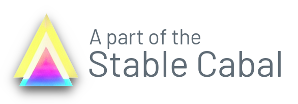

An implementation of a server for the Stability AI API

# Installation

## Colab (coming soon)

## Docker (easiest if you already have Docker, and an Nvidia GPU with 4GB+ VRAM)

```
docker run --gpus all -it -p 50051:50051 \
  -e HF_API_TOKEN={your huggingface token} \
  -e SD_LISTEN_TO_ALL=1 \
  -v $HOME/.cache/huggingface:/huggingface \
  -v `pwd`/weights:/weights \
  hafriedlander/stable-diffusion-grpcserver:xformers-latest
```

#### Localtunnel

The docker image has built-in support for localtunnel, which
will expose the GRPC-WEB endpoint on an https domain. It will
automatically set an access token key if you don't provide one.
Check your Docker log for the values to use

```
  -e SD_LOCALTUNNEL=1 \
```

#### Volume mounts

This will share the weights and huggingface cache, but you can
mount other folders into the volume to do other things:

- You can check out the latest version of the server code and then
mount it into the Docker image to run the very latest code (including
any local edits you make)

  ```
    -v `pwd`/sdgrpcserver:/sdgrpcserver \
  ```

- Or override the engines.yaml config by making a config directory,
putting the engines.yaml in there, and mounting it to the image

  ```
   -v `pwd`/config:/config \
  ```

All the server arguments can be provided as environment variables, starting
with SD:

- SD_ENGINECFG
- SD_GRPC_PORT
- SD_HTTP_PORT
- SD_VRAM_OPTIMISATION_LEVEL
- SD_NSFW_BEHAVIOUR
- SD_WEIGHT_ROOT
- SD_HTTP_FILE_ROOT
- SD_ACCESS_TOKEN
- SD_LISTEN_TO_ALL
- SD_ENABLE_MPS
- SD_RELOAD
- SD_LOCALTUNNEL

#### Building the image locally

```
docker build --target main .
```

Or to build (slowly) with xformers

```
docker build --target xformers .
```

## Locally (if you have an Nvidia GPU with 4GB+ VRAM, and prefer not to use Docker)

### Option 1 (recommended):

Install Miniconda, then in a Conda console:

```
git clone https://github.com/hafriedlander/stable-diffusion-grpcserver.git
cd stable-diffusion-grpcserver
conda env create -f environment.yaml
conda activate sd-grpc-server
```

Then for Windows:

```
set PIP_EXTRA_INDEX_URL=https://download.pytorch.org/whl/cu116 
flit install --pth-file
set HF_API_TOKEN={your huggingface token}
python ./server.py
```

Or for Linux

```
PIP_EXTRA_INDEX_URL=https://download.pytorch.org/whl/cu116 flit install --pth-file
HF_API_TOKEN={your huggingface token} python ./server.py
```

### Option 2:

Create a directory and download https://raw.githubusercontent.com/hafriedlander/stable-diffusion-grpcserver/main/engines.yaml into it, then

```
set PIP_EXTRA_INDEX_URL=https://download.pytorch.org/whl/cu116 
pip install stable-diffusion-grpcserver
set HF_API_TOKEN={your huggingface token} 
sdgrpcserver
```

# Features

- Txt2Img and Img2Img from Stability-AI/Stability-SDK, specifying a prompt
- Can load multiple pipelines, such as Stable and Waifu Diffusion, and swap between them as needed
- Mid and Low VRAM modes for larger generated images at the expense of some performance
- Adjustable NSFW behaviour
- Significantly enhanced masked painting:
  - When Strength < 1, uses normal diffusers inpainting (with improved mask gradient handling)
  - When Strength >= 1 and <= 2, uses seamless outpainting algorithm. 
    Strength above 1 acts as a boost - the higher the value, the more even areas protected by a mask are allowed to change
- All K_Diffusion schedulers available
- Cancel over API (using GRPC cancel will abort the currently in progress generation)
- Negative prompting (send a `Prompt` object with `text` and a negative `weight`)

# Thanks to / Credits:

- Seamless outpainting https://github.com/parlance-zz/g-diffuser-bot/tree/g-diffuser-bot-beta2
- Additional schedulers https://github.com/hlky/diffusers

# Roadmap

Core API functions not working yet:

- ChainGenerate not implemented

Extra features to add

- Progress reporting over the API is included but not exposed yet
- Embedding params in png
- Extra APIs
  - Image resizing
  - Aspect ratio shifting
  - Asset management
  - Extension negotiation so we can:
    - Ping back progress notices
    - Allow cancellation requests
    - Specify negative prompts
- CLIP guided generation https://github.com/huggingface/diffusers/pull/561
- Community features: 
  - Prompt calculation https://github.com/pharmapsychotic/clip-interrogator/blob/main/clip_interrogator.ipynb
  - Prompt suggestion https://huggingface.co/spaces/Gustavosta/MagicPrompt-Stable-Diffusion
  - Prompt compositing https://github.com/energy-based-model/Compositional-Visual-Generation-with-Composable-Diffusion-Models-PyTorch
  - Automasking https://github.com/ThstereforeGames/txt2mask
  - Other schedulers (needs custom pipeline for some). https://github.com/huggingface/diffusers/commit/489894e4d9272dec88fa3a64a8161aeab471fc18
  - Huge seeds
- Other thoughts
  - Figure out how to just suppress NSFW filtering altogether (takes VRAM, if you're not interested)


[](https://www.stablecabal.org/)
